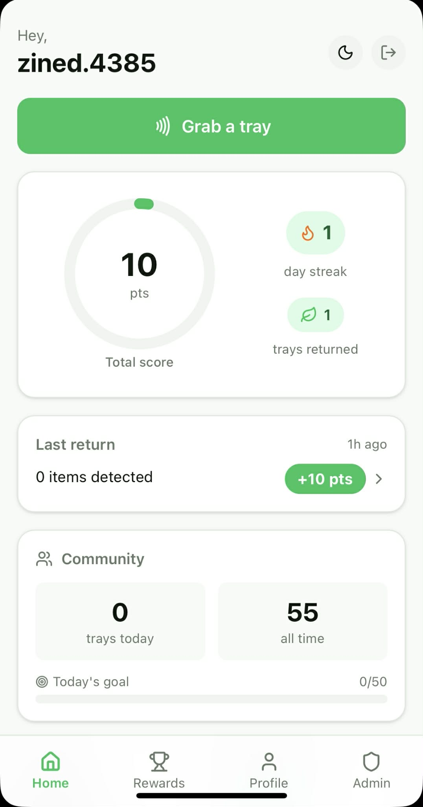
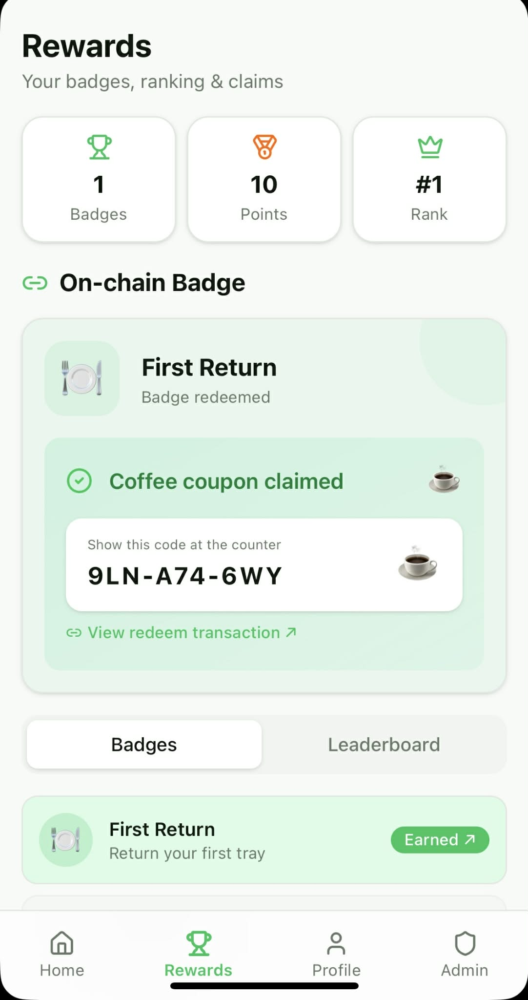
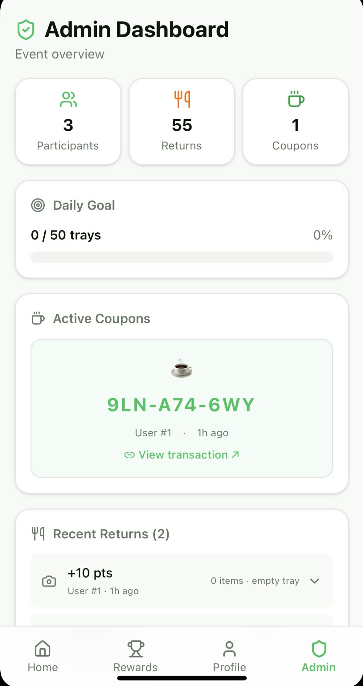

# Verifeed

Gamified food tracking for cafeterias, events, and food aid programs.

Return a tray, earn points and on-chain badges, redeem them for rewards. AI vision estimates food waste for venue analytics. World ID prevents abuse, Chainlink CRE automates badge minting.

<p align="center">
  
  
  
</p>

## Setup

```bash
cd traycer
npm install
cp .env.example .env.local
npm run dev
```

## Structure

- `src/` — Next.js app (pages, API routes, components)
- `chainlink/` — CRE workflow + ERC-1155 contract (World Chain)
- `rpi/` — Raspberry Pi station (NFC + camera, Python)

## Stack

- Next.js, React, Tailwind CSS
- World ID / MiniKit (identity + Mini App)
- Chainlink CRE (automated on-chain minting)
- Google Gemini (food image analysis)
- Raspberry Pi + PN532 NFC + Arx HaLo wristbands

Built at ETH Cannes 2026.
